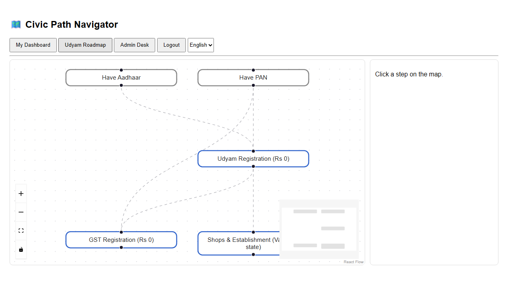

# Civic Path Navigator — Municipal Bureaucracy Path Visualizer (PSWB 02)

Citizens describe a civic task in plain words; the system turns fragmented
government websites into a **verified, step-by-step dependency map** — and,
after DigiLocker login, into a **personal civic twin**: what you hold, what it
unlocked, and your easiest next win.



## Quick start (all free, ₹0)

```bash
# backend
C:\Users\Raja\.venv-civic\Scripts\python -m uvicorn app.main:app   # in backend/
# frontend
npm run dev                                                         # in frontend/ → :5173
```

## What it does

- **Roadmap graphs** — React Flow DAGs (dagre layout) of forms, offices, fees,
  prerequisites; every step links its official `.gov` source.
- **Personal twin** — JWT login → DigiLocker OAuth (consent-first) → per-user
  encrypted vault → deterministic eligibility engine → `/me/dashboard` +
  plain-words LLM brief (Bynara free models first, local Ollama fallback).
- **Trust core** — no proof link = no display; admin verify stamps; night
  watchman re-fingerprints sources and **auto-revokes** verification on change.
- **Security** — app-wide rate limits, 5-strike lockout (423), OTP login,
  per-user Telegram link codes (single-use, 15-min), LLM-blinded prompts.
- **Channels** — Telegram worker (`app/hermes.py`: /start /status /next),
  mail lane (console → SMTP/Zoho → Resend), in-page Guide-me (page-agent).
- **Hindi toggle** (App + Dashboard) + WCAG basics (focus rings, labels, alerts).

## Repo map

| Path | What |
|---|---|
| `backend/app/main.py` | FastAPI: auth, vault, dashboard, maps, progress, admin, jobs, webhooks |
| `backend/app/worker.py` | Scrape cascade: trafilatura → crawl4ai → obscura → Bynara extract |
| `backend/app/watch.py` | Change detector (sha256 fingerprints, auto-unverify, alerts) |
| `backend/app/digilocker.py` | MeriPehchaan OAuth2+PKCE + issued-docs (sandbox live, prod needs creds) |
| `backend/app/eligibility.py` | Deterministic rules: have → unlocked → next-easiest |
| `backend/app/llm.py` | Bynara free-model role routing → Ollama → template (never raises) |
| `backend/app/security.py` | Rate limiter + lockout policy |
| `backend/app/hermes.py` | Telegram long-poll worker (zero extra deps) |
| `backend/app/migrate.py` | Versioned migrations — DB is never deleted |
| `backend/sim/` | Life-sim (mock DigiLocker + fixture gov page), 20-persona suite |
| `backend/tests/` | pytest suite (CI runs it) |
| `frontend/src/` | React + TS + React Flow + dagre + page-agent guide |

## Verify

```bash
python -m pytest backend/tests/ -q        # 9 tests
python backend/sim/run_sim.py             # 8-step life sim (mock world)
python backend/sim/run_personas.py        # 20 personas, 20/20 sane
```

## Docs

- `PENDING.md` — what's left (2 credentials + institutional track)
- `DEPLOY.md` — Cloudflare Pages + tunnel + cron (all free tiers)
